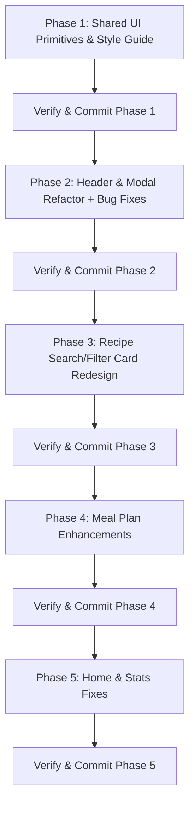

# Version 1.2.2 Implementation Plan & Modular Phases

This document outlines the grouped changes and step-by-step phases for v1.2.2. Each phase is designed to be self-contained so that one separately guided implementation agent can execute it with minimal context overlap. The user remains the decision-maker for UI behavior and visual sign-off throughout the phase.

> [!IMPORTANT]
> - **One Agent Per Phase**: Start a fresh implementation agent for each phase. Give it only the current phase, the relevant repository instructions, and the current baseline.
> - **User-Gated UI Work**: An agent may implement and validate code, but it must pause at each UI review gate for the user to inspect the running application and approve, request iteration, or reject the direction.
> - **Per-Phase Verification**: Each stage ends with focused tests, lint/type checks, and user-approved visual verification before committing.
> - **Isolated Git Commits**: Commit each phase separately only after its user sign-off and clean verification, preserving an atomic history.

## Guided Agent Workflow

The phases are executed sequentially by the user, with a separate agent assigned to each phase. The agent is an implementer and verifier, not the UI decision-maker. The user may stop the agent after any gate, request a focused revision, and repeat that gate before allowing the phase to continue.

### Standard phase protocol

1. **Handoff**: Provide the agent with this plan, the applicable phase section, `copilot-instructions.md`, the focused documentation listed there, and the current `git status`. Tell it not to modify later-phase scope or commit without approval.
2. **Baseline gate**: The agent inspects the existing implementation, identifies the owning files, records relevant existing behavior and tests, and proposes the smallest implementation slice. The user confirms the scope before code changes begin.
3. **Implementation checkpoint**: The agent implements one coherent slice at a time. After each slice, it runs the narrowest available test or type check and reports changed files, behavior, and any remaining UI decisions.
4. **UI review gate**: For every user-facing component or layout change, the agent starts or refreshes the app, provides the route and test state to inspect, and pauses for the user to review desktop and relevant narrow/theme states. No phase is considered visually complete from screenshots or automated tests alone.
5. **Iteration loop**: The user responds with `approve`, `iterate: ...`, or `reject`. On `iterate`, the agent changes only the requested UI slice, reruns the focused validation, and returns to the same UI review gate. It must not proceed to unrelated work while that gate is open.
6. **Phase sign-off gate**: After all UI gates are approved, the agent runs the phase-specific focused tests, lint, web type checking, and full test suite. The user reviews the verification report and explicitly signs off before the phase is committed.
7. **Handoff**: Record the commit hash, tests run, manual states reviewed, accepted exceptions, and any follow-up risks. The next phase starts from that committed baseline with a new agent.

### UI review response contract

Use these short responses to keep iteration unambiguous:

- `approve`: the inspected UI slice is accepted; continue to the next gate.
- `iterate: <specific request>`: revise only the named visual or interaction concern, then return to the same gate.
- `reject: <reason>`: stop that direction, explain the affected scope, and wait for the user to choose a revised approach.

Agents must show the user the actual route or modal state, not only component tests. For UI changes, the handoff must identify the viewport, theme, data state, keyboard/focus state, and interaction path that the user should inspect. Automated checks may prove behavior, but they do not substitute for user approval of spacing, hierarchy, wrapping, visual emphasis, motion, or control placement.

---

## User Review Required

> [!IMPORTANT]
> - **Shared Components Introduced**: We are introducing shared `ModalShell` and `PageHeader` components to normalize modal layouts and page headers across the codebase.
> - **STYLE-GUIDE Rule Update**: All primary submit/action buttons in modals (e.g. `Generate List`, `Create List`, `Add Meal`, etc.) will be standardized to use the orange accent token (`--accent` / `variant="accent"`).
> - **Meal Plan Drag-to-Week-Change Threshold**: Dragging over the left 1/4 of Monday or right 1/4 of Friday will require hovering for a brief delay threshold (e.g. ~400ms) before changing weeks to prevent accidental triggers.

---

## Phased Execution Overview



---

## Phase 1: Shared UI Primitives & Design System Documentation

### Objectives
1. Create a common modal shell component (`ModalShell.tsx`) to unify modal styling, header Phosphor `X` close icon centering, and customizable left/right action footers.
2. Create a shared `PageHeader.tsx` component to normalize eyebrow, page title (Georgia serif), and page subtitle hierarchy across tabs.
3. Update [`STYLE-GUIDE.md`](file:///c:/Users/justi/Documents/Git/general-dev/copilot-chef/copilot-chef/docs/STYLE-GUIDE.md) to mandate orange accent submit buttons (`--accent` / `variant="accent"`) in all modal footers.
4. Establish the shared primitive's scope before Phase 2 migration so existing modal-specific behavior, focus management, and confirmation semantics are not regressed.

### Proposed Changes

#### [NEW] [ModalShell.tsx](file:///c:/Users/justi/Documents/Git/general-dev/copilot-chef/copilot-chef/src/renderer/components/ui/ModalShell.tsx)
- Standardized modal overlay, card container, and header with centered Phosphor `X` close icon button.
- Flexible header supporting optional eyebrow, title, and subtitle.
- Footer component supporting left and right aligned button clusters.
- Accepts arbitrary body content and class/style overrides for scrollable, wide, tall, and multi-step modal bodies.
- Preserves accessible dialog labeling (`aria-labelledby`/`aria-describedby` or an explicit accessible label), focusable panel behavior, overlay click handling, and disabled close behavior when an operation is in progress.
- Uses semantic surface, text, border, overlay, and elevation tokens so the shell works in light, dark, and custom themes.
- Keeps close-button icon rendering and alignment in the shell, while allowing a modal to opt out when its header has specialized controls.

#### Modal inventory and Phase 1 boundary
- Shared-shell candidates to account for in Phase 2: `NewListModal`, the Prep Lists create and notes modals, `AddRecipeModal`, `IngestModal`, `RecipeExportModal`, `EditModal`, `RecipeSearchModal`, `DuplicateMealModal`, `SlotManagerModal`, `PersonaModal`, `MealTypeProfileModal`, and `LanQrCodeModal`.
- `RecipeMadeHistoryModal`, `DerivedRecipesModal`, `MenuPrintExportModal`, and `DeleteConfirmationModal` should be evaluated during Phase 2 rather than assumed to be identical. Their specialized viewers, nested dialogs, destructive actions, or multi-step content may require shell slots or should remain on their current implementation.
- The existing Radix `AlertDialog` primitive remains the owner for confirmations used by Recipe deletion, Prep Lists, Settings, and data management. `ModalShell` must not replace Radix focus handling, announcement semantics, or `AlertDialogAction`/`AlertDialogCancel` behavior.
- `ModalShell` is a visual/layout primitive, not a replacement for every overlay or dialog. `DropIntentPopover`, non-modal popovers, photo viewers, and print/export-specific nested surfaces remain specialized unless a later phase identifies a concrete benefit.

#### [NEW] [ModalShell.module.css](file:///c:/Users/justi/Documents/Git/general-dev/copilot-chef/copilot-chef/src/renderer/components/ui/ModalShell.module.css)
- CSS module for modal positioning, flex layout, close button centering, and dark mode semantic surface compliance.

#### [NEW] [PageHeader.tsx](file:///c:/Users/justi/Documents/Git/general-dev/copilot-chef/copilot-chef/src/renderer/components/ui/PageHeader.tsx)
- Standardized page header component taking `eyebrow`, `title`, `subtitle`, and optional `actions` slot.

#### [NEW] [PageHeader.module.css](file:///c:/Users/justi/Documents/Git/general-dev/copilot-chef/copilot-chef/src/renderer/components/ui/PageHeader.module.css)
- Typography and flex layout styling matching [`docs/STYLE-GUIDE.md`](file:///c:/Users/justi/Documents/Git/general-dev/copilot-chef/copilot-chef/docs/STYLE-GUIDE.md) page header patterns.

#### [MODIFY] [STYLE-GUIDE.md](file:///c:/Users/justi/Documents/Git/general-dev/copilot-chef/copilot-chef/docs/STYLE-GUIDE.md)
- Add standard rule under Modal & Popover Surfaces and Buttons requiring all primary submit/confirmation action buttons in modals to use the orange accent token (`--accent` / `variant="accent"`).
- Clarify that the accent rule applies to primary submit/create/save/import/generate actions, while destructive actions remain destructive-token buttons and neutral actions remain outline/ghost buttons.
- Document semantic token requirements for modal surfaces and the accessibility contract for dialog labels, focus behavior, Escape handling, and disabled close controls during in-flight operations.

### Phase 1 Verification & Testing
- Add focused component tests for `ModalShell` and `PageHeader`, including accessible names, optional eyebrow/subtitle/actions, left/right footer placement, close-button behavior, semantic class/token usage, and representative narrow/mobile layout classes.
- Run focused tests for at least one migrated shell candidate from each distinct pattern: a form modal, a scrollable/settings modal, and a modal with left/right footer actions. Keep Radix `AlertDialog` tests covering confirmation behavior unchanged.
- Run TypeScript type checking, lint, and the unit test suite:
  ```powershell
  npm run lint
  npx tsc -p tsconfig.web.json --noEmit
  npm test
  ```
- Verify that `ModalShell` and `PageHeader` export cleanly without lint or compilation errors, and manually inspect one light-theme and one dark/custom-theme modal for contrast, close-icon centering, focus placement, Escape behavior, and footer wrapping.

### Phase 1 User Gates

- **Gate 1, primitive contract**: Before migration work, the user reviews the proposed `ModalShell` and `PageHeader` API, representative markup, and visual direction. Approval confirms that the shell has enough slots and escape hatches without forcing specialized dialogs into the shared abstraction.
- **Gate 2, primitive visual review**: The user inspects a representative form modal and page header in light, dark/custom, desktop, and narrow layouts. Review includes typography hierarchy, close-icon centering, footer alignment, focus placement, Escape behavior, overlay treatment, and wrapping.
- **Gate 3, migration readiness**: The user reviews the candidate inventory and the agent's list of migrations and explicit exceptions. The agent may proceed only after the user approves which patterns are safe to migrate.
- **Sign-off evidence**: The agent records approved API decisions, inspected states, requested iterations, and unresolved exceptions before the phase commit.

### Phase 1 Git Commit
- Once verified, execute:
  ```powershell
  git add docs/STYLE-GUIDE.md src/renderer/components/ui/ModalShell.tsx src/renderer/components/ui/ModalShell.module.css src/renderer/components/ui/PageHeader.tsx src/renderer/components/ui/PageHeader.module.css
  git commit -m "feat(ui): add ModalShell and PageHeader shared components and update style guide"
  ```

---

## Decision Closure Before Phases 2–5

The following material decisions are closed for implementation:

- Cutoff evaluation is server-authoritative. The upcoming-meal API returns a server-derived `passedCutoff` state for today's meals; the renderer does not reimplement cutoff calculations.
- A duplicate target is a target date plus an enabled `MealTypeDefinition`. “Custom slot” does not introduce a new persistence model and is not a meal subtype.
- WeekView edge navigation uses a measured, board-level overlay over the meal area. It does not restructure the existing flat grid into nested day wrappers.
- Compact WeekView retains horizontal scrolling, with narrower minimum columns, tighter spacing, and readable wrapping below 900px and 768px.

Before starting Phase 2, perform a baseline reconciliation. Phase 1 shared files are not currently present, while cutoff persistence, validation, migration/backfill, live summary counting, route wiring, and one-minute dashboard summary refresh already exist. Do not recreate those completed cutoff pieces. Confirm the worktree and update the affected-file list if another change lands first.

---

## Phase 2: Page Header & Modal Standardizations + Modal Bug Fixes

### Objectives
1. Adopt `PageHeader` across the actual page-header owners while preserving complex action toolbars.
2. Migrate only modal candidates that can use `ModalShell` without changing portal, focus, Escape, scroll-lock, nested-dialog, or async-close behavior.
3. Fix close-button centering on Grocery List and Prep List create modals.
4. Use `variant="accent"` for the Prep List `Generate List` action and other primary modal submit/create/save/import/generate actions; keep destructive and neutral actions unchanged.

### Proposed Changes

#### Page headers
- Update `recipes.tsx`, `grocery-list.tsx`, and `prep-lists.tsx` to use `PageHeader`.
- Audit `meal-plan.tsx`, `stats.tsx`/`StatsDashboard.tsx`, `settings.tsx`, and `home-dashboard.tsx` and either migrate them or document a concrete exception. `PageHeader` must expose an actions slot that can contain Meal Plan's Add Meal, Print/Export, Today, view, and undo/redo controls without flattening their layout.

#### Modal migration
- Audit `NewListModal.tsx`, the Prep Lists create/notes modals, `AddRecipeModal.tsx`, `IngestModal.tsx`, `RecipeExportModal.tsx`, `EditModal.tsx`, and `RecipeSearchModal.tsx` before migration.
- For each candidate, preserve accessible naming, initial focus, focus restoration, Escape and overlay behavior, scroll locking, form submission, error display, and disabled close while an operation is in flight.
- Leave Radix `AlertDialog` confirmations, specialized viewers, nested dialogs, and print/export-specific surfaces unchanged unless the shell provides an explicit compatible slot.

### Phase 2 Verification & Testing
- Add focused tests for one form modal, one scrollable modal, one async/in-flight modal, and one modal with left/right footer actions. Keep existing Radix confirmation tests unchanged.
- Add page-header tests or render assertions for the actions-slot contract and migrated pages.
- Run:
  ```powershell
  npx vitest run src/renderer/components/grocery-list/NewListModal.test.tsx
  npm run lint
  npx tsc -p tsconfig.web.json --noEmit
  npm test
  ```
- Manually inspect Grocery List and Prep List modals in light/dark themes, including focus placement, Escape, close-button centering, in-flight close prevention, footer wrapping, and accent action contrast.

### Phase 2 User Gates

- **Gate 1, page headers**: The user reviews each migrated page header, including the Meal Plan action-toolbar exception, at desktop and narrow widths. Approval covers title/subtitle hierarchy, action placement, spacing, and whether any page should remain an explicit exception.
- **Gate 2, modal-by-modal migration**: The agent presents each migrated modal, or a representative group of identical patterns, for review. The user checks close-button alignment, body scrolling, footer hierarchy, primary accent action emphasis, and preservation of specialized controls.
- **Gate 3, interaction regression**: The user manually exercises opening, initial focus, Escape, overlay click, focus restoration, validation/error states, and in-flight close prevention for the selected modal patterns. Any failure returns the agent to the affected modal before further migration.
- **Sign-off evidence**: The agent records approved page-header and modal states, exceptions left unchanged, and UI iterations before the phase commit.

### Phase 2 Git Commit
- Once verified, execute:
  ```powershell
  git commit -m "refactor(ui): adopt PageHeader and ModalShell across tabs and fix modal close button styling"
  ```

---

## Phase 3: Recipe Page Search, Sort & Filter Redesign

### Objectives
1. Move the existing search, sort, and filter controls into a consolidated card directly below the recipe page header.
2. Add an accessible `Advanced` disclosure for Origin, Cuisine, and Favourites-only controls.
3. Animate expansion and collapse without changing query parameters, sorting semantics, session persistence, or server filtering.

### Proposed Changes

#### [MODIFY] [recipes.tsx](file:///c:/Users/justi/Documents/Git/general-dev/copilot-chef/copilot-chef/src/renderer/pages/recipes.tsx)
- Keep `recipeFilters`, query keys, sort preset/session behavior, clear behavior, and mutation invalidation unchanged.
- Move control ownership into the new card through controlled props and callbacks; do not introduce a second filter state model.

#### [NEW] / [MODIFY] [RecipeSearchFilterCard.tsx](file:///c:/Users/justi/Documents/Git/general-dev/copilot-chef/copilot-chef/src/renderer/components/recipes/RecipeSearchFilterCard.tsx)
- Encapsulate search, sort-by, sort-order, conditional search-sort mode, Advanced disclosure, Origin, Cuisine, Favourites-only, and Clear filters.
- Use `aria-expanded` and `aria-controls`, preserve keyboard operation, and keep selected controls usable while the drawer is collapsed or expanded.

#### [MODIFY] [recipe-list.module.css](file:///c:/Users/justi/Documents/Git/general-dev/copilot-chef/copilot-chef/src/renderer/components/recipes/recipe-list.module.css)
- Add card and disclosure transition styles in the owning recipe-list stylesheet. Provide a reduced-motion fallback and do not hide expanded controls from assistive technology.

### Phase 3 Verification & Testing
- Add component/page tests for search, origin, cuisine, favourites, sort-by, sort order, relevance mode, clear filters, disclosure accessibility, keyboard operation, and query-driving callbacks.
- Verify narrow layout and reduced-motion behavior manually.
- Run `npm run lint`, `npx tsc -p tsconfig.web.json --noEmit`, and `npm test`.

### Phase 3 User Gates

- **Gate 1, collapsed filter card**: The user reviews the initial recipe-page layout at desktop and narrow widths. Approval covers the card's placement below the header, search prominence, sort control grouping, clear action visibility, and density.
- **Gate 2, Advanced disclosure**: The user opens and closes the Advanced section with mouse and keyboard, then reviews Origin, Cuisine, and Favourites-only controls in light and dark themes. Approval covers the disclosure affordance, animation speed, focus order, wrapping, and whether the expanded content is discoverable without dominating the page.
- **Gate 3, behavior and reduced motion**: The user verifies that changing, clearing, and restoring filters preserves the expected URL/session behavior, and inspects the reduced-motion presentation. Any visual or interaction concern is iterated in the card before sign-off.
- **Sign-off evidence**: The agent records approved collapsed/expanded states, viewport and theme states, reduced-motion results, and query-behavior test results before the phase commit.

### Phase 3 Git Commit
- Once verified, execute:
  ```powershell
  git commit -m "feat(recipes): redesign search and sort UI with animated expandable advanced filter drawer"
  ```

---

## Phase 4: Meal Plan Enhancements (Duplicate Slot, Drag Week Switcher, Compact View)

### Objectives
1. Let duplication target any enabled meal-type definition available for a selected date, including custom and date-ranged profile definitions.
2. Let users move the viewed week forward with explicit week-navigation buttons, without allowing historical weeks, and return directly to the current week.
3. Navigate weeks when a drag hovers over the left quarter of Monday or right quarter of Friday's meal area for approximately 400ms.
4. Improve compact readability while retaining horizontal scrolling for the seven-day board.

### Proposed Changes

#### [MODIFY] [DuplicateMealModal.tsx](file:///c:/Users/justi/Documents/Git/general-dev/copilot-chef/copilot-chef/src/renderer/components/meal-plan/DuplicateMealModal.tsx)
- Render each target day's enabled `MealTypeDefinition` as a selectable sub-option, submit its slug and ID, and disable unavailable/source-day definitions and all controls while duplicating. Preserve the existing create-meal and undo snapshot contract.

#### [MODIFY] [WeekView.tsx](file:///c:/Users/justi/Documents/Git/general-dev/copilot-chef/copilot-chef/src/renderer/components/meal-plan/WeekView.tsx)
- Add explicit accessible week controls to the existing period navigator: a `Next week` button that advances by seven days and a `Current week` button that returns to the week containing today. The current-week action should be disabled, or otherwise clearly inactive, when the viewed week already contains today.
- Treat the week containing today as the lower navigation boundary. Do not render or enable a previous-week action, and guard every week-changing path, including drag edge navigation, so it cannot move the view to a week ending before the current week. Future weeks remain reachable one week at a time.
- Keep the current viewed date anchored to the existing week calculation so the buttons, drag navigation, view switching, and month/day transitions agree on the same Monday-to-Sunday range. Preserve the existing page-level `Today` behavior for other calendar views while making the week navigator's return-to-current-week affordance explicit.
- Add a board-level measured overlay covering only the meal rows, positioned from Monday and Friday board geometry. It must stop below the date headers and avoid interfering with ordinary drops outside the edge zones.
- Accept structured or detectable drag payloads before a drop, show a direction arrow/highlight, and use one cancellable timer per direction.
- Cancel timers and clear overlay state on leaving, direction change, `dragend`, `drop`, cancellation, unmount, and failed application. Prevent repeated navigation until the pointer leaves and re-enters.
- Preserve existing slot/meal `onDropPayload` behavior and avoid duplicate drop handling.

#### [MODIFY] [meal-plan.module.css](file:///c:/Users/justi/Documents/Git/general-dev/copilot-chef/copilot-chef/src/renderer/components/meal-plan/meal-plan.module.css)
- At 900px and 768px, reduce board column minimums and cell padding/gaps while retaining the horizontal scroller.
- Allow long custom labels and meal names to wrap without overlapping actions, dots, dates, or neighboring cells.

### Phase 4 Verification & Testing
- Extend `DuplicateMealModal.test.tsx` for custom definitions, date-ranged profiles, disabled/unavailable definitions, selected definition IDs, source-day restrictions, and in-flight state.
- Extend WeekView tests for forward-only button navigation: advancing exactly one week, returning to the current week from a future week, disabling the current-week action when already current, preventing previous-week navigation at the boundary, and preventing date changes before the current week through every navigation path.
- Extend WeekView drag tests with fake timers for below-threshold cancellation, threshold navigation, repeated `dragover`, direction changes, leaving, `dragend`, drop, unmount, boundary blocking, and normal drop forwarding.
- Manually verify the week controls from the current week and a future week, confirm historical weeks cannot be opened, confirm the return-to-current-week action, then verify edge overlays, one navigation per entry, normal drops, and compact layouts at desktop, 900px, 768px, and narrow mobile widths.
- Run focused Vitest tests, `npm run lint`, `npx tsc -p tsconfig.web.json --noEmit`, and `npm test`.

### Phase 4 User Gates

- **Gate 1, duplicate target selection**: The user reviews the duplicate modal with standard, custom, date-ranged, unavailable, and disabled definitions. Approval covers hierarchy, selected-state clarity, source-day restrictions, disabled messaging, and in-flight feedback.
- **Gate 2, week controls**: The user reviews current-week and future-week states at desktop and narrow widths. Approval covers button labels/icons, disabled current-week behavior, forward-only navigation, date anchoring, and the relationship to existing Today and view controls.
- **Gate 3, drag edge navigation**: The user performs normal drops and edge-hover navigation with valid and invalid payloads. Review covers overlay geometry, arrow/highlight visibility, threshold timing, re-entry behavior, cancellation, and the absence of interference with ordinary meal-row drops.
- **Gate 4, compact board**: The user inspects 900px, 768px, and narrow mobile layouts with long meal names and custom labels. Approval covers horizontal scrolling, readable wrapping, action placement, and the absence of overlap or accidental page-level scrolling.
- **Sign-off evidence**: The agent records approved modal, navigation, drag, and responsive states, including any accepted interaction exceptions, before the phase commit.

### Phase 4 Git Commit
- Once verified, execute:
  ```powershell
  git commit -m "feat(meal-plan): support slot-specific duplication, drag week-switching hover zones, and compact responsive styling"
  ```

---

## Phase 5: Home & Stats Fixes (Upcoming Meals Cutoff Logic & Dark Theme Tooltips)

### Objectives
1. Return enough server-derived upcoming-meal state to dim today's passed meals while omitting today only when no qualifying meals remain.
2. Make all Recharts and heatmap tooltip surfaces use explicit semantic background, text, label/item, and border tokens in light and dark themes.

### Proposed Changes

#### Upcoming meals ownership
- Reconcile the existing cutoff persistence, migration/backfill, live summary service, stats route, and one-minute HomeDashboard refresh before making changes.
- Update the meal service and `/api/meals/upcoming`, not `QuickReference`, to define and expose the contract. Add a server-derived `passedCutoff` flag for today's meals.
- Retain today's passed meals for presentation when at least one qualifying meal remains; omit the entire current-day group when no qualifying meal remains. Do not calculate cutoff times in the renderer.
- Add the passed visual state in `home-dashboard.tsx` using semantic tokens. `QuickReference.tsx` is out of scope unless a separate grocery-list requirement is added.

#### Stats tooltips
- Update `ActivityHeatmap.module.css` and all chart tooltip configurations (`CuisineChart`, `DayOfWeekChart`, `MealTypeChart`, and `WeeklyTrendChart`) to set background, text/item, label, and border colors explicitly from semantic tokens.
- Prefer a shared tooltip style/content helper if it reduces repeated Recharts configuration without changing chart behavior.

### Phase 5 Verification & Testing
- Add meal-service and route tests for cutoff boundaries, mixed/current-day groups, fully passed days, future/prior dates, legacy fallback, null dates, and one-slot-per-date/type deduplication.
- Add HomeDashboard tests for passed styling and omission of a fully passed current-day group. Do not add client-side cutoff calculation tests.
- Verify tooltip styles in both `data-theme="light"` and `data-theme="dark"`, including heatmap text and Recharts labels/items.
- Run:
  ```powershell
  npx vitest run src/main/server/services/meal-service.analytics.test.ts src/main/server/routes/stats.test.ts src/renderer/components/home/home-dashboard.test.tsx
  npm run lint
  npx tsc -p tsconfig.web.json --noEmit
  npm test
  ```
- Manually verify Home and Stats in light/dark themes and confirm Electron/browser clients receive the same server-derived behavior.

### Phase 5 User Gates

- **Combined review gate**: The user reviews Home and Stats together through Electron and browser clients. The review covers prior, current, mixed, fully passed, future, null, and legacy meal states; dimming and current-day group omission; date grouping; light and dark themes; every chart and the heatmap tooltip background, text, labels, item values, borders, hover contrast, and narrow-width clipping or overflow. The passed state remains dimming-only without a visible cutoff label or client-side cutoff calculation.
- **Sign-off evidence**: The agent records the data states, routes, runtimes, themes, viewports, and tooltip surfaces inspected, plus any accepted visual exceptions, before the phase commit. The user gives one explicit approval for the combined gate.

### Phase 5 Git Commit
- Once verified, execute:
  ```powershell
  git commit -m "fix(home-stats): apply cutoff time rules to upcoming meals and fix stats chart tooltip dark mode contrast"
  ```

---

## Cross-Phase Acceptance and Handoff

- Every phase uses one separately guided agent, records a baseline decision, pauses at each listed UI gate, and stages only its own files.
- A UI gate is not complete until the user explicitly responds with `approve`; automated screenshots, tests, or agent judgment alone do not constitute sign-off.
- On `iterate`, the agent changes only the requested slice, reruns its focused validation, and returns to the same gate. On `reject`, it stops and waits for a revised direction.
- Every phase records focused tests before the full suite, the manual states reviewed, user approvals, requested iterations, accepted exceptions, and the resulting commit hash.
- Existing user changes and unrelated worktree files are preserved.
- No phase changes the public API or persistence contract without an explicit compatibility and regression test.
- Required Phase 5 edge cases are prior dates, future dates, mixed passed/future meals today, fully passed today, exact cutoff minute, unknown/legacy definitions, null dates, and duplicate dishes counting once.
- Required Phase 4 edge cases are unavailable or disabled target definitions, source-day restrictions, drag timer cancellation, direction changes, re-entry, drop cleanup, unmount cleanup, and normal drop forwarding.
- The plan is implementation-ready after baseline reconciliation confirms the current cutoff work and Phase 1 remains the immediate prerequisite. Each later phase begins only from the prior phase's signed-off commit and with a fresh guided agent.
